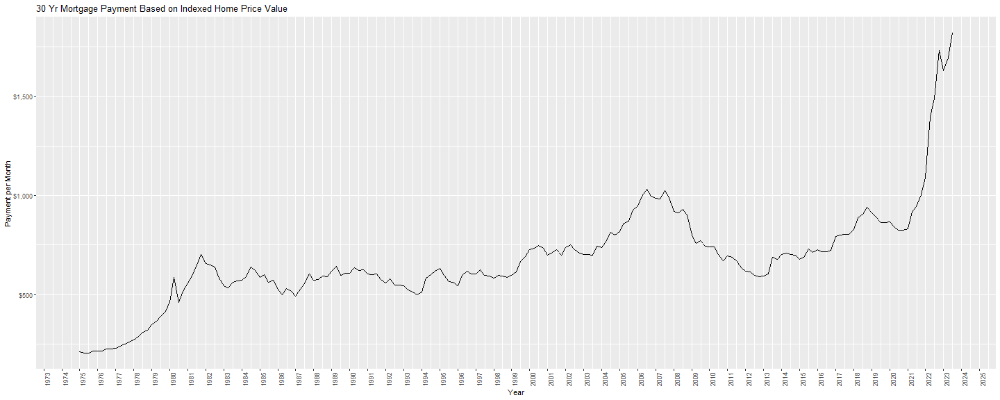

## Data Source

The major data source used in this analysis came from **quantmod** package for R:

-   30-year-fixed mortgage rate data (MORTGAGE30US)
-   HPI (House Price index) data (USSTHPI)
-   Median Household Income data (MEHOINUSA672N)
-   Annual inflation rate data measured by CPI (FPCPITOTLZGUSA)

## Mortgage Rate Environment

Mortgage rates have gone up over double since 2021! We have not seen rates this high in at least 15 years, but this is not new ground.

Rates in the 1980's were in the double digits, and people still bought houses. The problems we face today are similar, yet different than the prior mortgage meltdown. The market we are facing is much different than when rates were higher in the past as well.


## Housing Prices

Client payments are mainly determined by housing prices, which have risen sharply over time, outpacing inflation. The 2020 Pandemic introduced a unique experience to the home buying process, unlike anything seen before.

Buyers in the US were basically barred from purchasing homes from March to May 2020. Stimulus measures were implemented shortly after, and individuals who previously required proximity to their workplace suddenly found themselves able to work from anywhere. Concurrently, mortgage rates reached historic lows. Additionally, the implosion of a significant asset class, cryptocurrency, resulted in substantial profits for some individuals and venture capital firms, provided they had withdrawn their investments.

These factors rendered traditional rules nearly obsolete. Buyers were willing to purchase homes without physically visiting them, relying instead on photographs and street views, as many homes were not open for viewing. Consequently, bidding wars became common. As mortgage rates eventually increased, a negative externality emerged: individuals who had refinanced or purchased homes in 2020-2021 found themselves locked into their current properties due to affordability issues. While they could sell and realize profits, the cost of their next home, including interest rates and property prices, differed significantly from the economic conditions they had previously experienced. Today, inventory remains low, so prices are still elevated.


## Homeowner Mortgage Payments

The cost of a client's mortgage is largely determined by housing prices and interest rates. However, as depicted in the charts above, this combination does not bode well for affordability.

By utilizing median household values, we can illustrate the payments clients would need to make to purchase a home in the current market (see below).

Unfortunately, the average payment for a new house, financed with a 30 year fixed loan, has nearly doubled.



### Deeper Look into Payments

The charts below display the total payment amount (principal + interest) for various timeframes over the past 40 years.

In 1980, when interest rates were exceptionally high, more than 95% of the payments went toward interest in the initial years of the loan. Today, this figure has reduced to the mid-60s%.

Additionally, the total payment amount is shown on the y-axis. In 1980, a loan payment would have been \$465, whereas today, it exceeds \$1,080. These charts clearly illustrate that both overall payments and interest costs over time have significantly increased compared to historical figures.


The charts below illustrate the percentage of the overall payment that is allocated to interest. It is evident from the charts that a larger portion of the payment now goes towards the principal balance.

While this is a positive development, the charts above reveal that payments have tripled over time, and despite the larger portion going to principal, the interest paid today nominally exceeds historical levels, even when interest comprised over 95% of the payment.

This is part of the story for affordability, in the next section we will look at the other half of the equation: Income.


## Income

The cost of homeownership has increased substantially since the 1980s, particularly in recent years where it has experienced a dramatic surge. Although we have seen incomes rise, this increase has not kept pace with the inflation of costs. From 1984 to 2022, the median household income has only experienced a total growth of about 31%, while the housing costs have surged by over 200% during the same period. This discrepancy is highly concerning.


### Income to Home Prices Ratio

A good measure of affordability is housing prices to income ratio. This metric has also increased significantly over time, raising concerns about the sustainability of market price increases for the average American. In addition, speculation and corporate purchases are now competing with everyday people in the housing market, driving up prices in certain markets and reducing the home availability for individual buyers. This dynamic poses challenges for both home buyers and the mortgage industry.


## Mortgage Operation Milestones

There are some major milestones that are generally applicable in the mortgage process.

**Lead Creation** - This marks the initial stage where a potential borrower expresses interest in obtaining a mortgage or a mortgage lender proactively reach out to a potential borrower. This could occur through various channels.

**Credit Pull** - Once a lead expresses serious interest in obtaining a mortgage, the lender typically performs a credit check to assess the borrower's creditworthiness. This involves pulling the borrower's credit report to evaluate their credit history and current credit score.

**PAL (purchase only)** - PALs (pre-approval letters) are instruments used by clients to make a more trusted offer when buying a house.

**Application** - The stage involves the formal submission of a mortgage application by the borrower, including providing detailed information about their financial situation, employment history, and the property they wish to purchase or refinance.

**Folder** - This is when the banker and client have finished filling out the Form 1003 and are ready for the underwriting process to begin.

**Closing** - The closing is the final step in the mortgage process where the borrower signs the loan documents and takes ownership of the property. At closing, the borrower pays any closing costs and fees, and the lender disburses the loan funds.

Below, I'll use hypothetical numbers to illustrate the waterfall funnel process of converting leads into closed loans..


```
## Error in loadNamespace(name): there is no package called 'webshot'
```

### Mortgage Process Turn Time: Refinance vs. Purchase

How fast do leads move through the mortgage process? In the following series of plots, I'll use hypothetical numbers to illustrate this. With two distinctive groups, purchase and refi, I will explore their respective turn times from lead creation to close.

The below chart demonstrates that approximately 85% of ***refinance*** leads were closed within 50 days of lead creation and about half of the refi leads were closed within 30 days.

#### Refinance


#### Purchase

In comparison, when looking at purchase, we see that to hit that same level (\~85% or all purchases), we would need to wait 100 days from lead creation to closing.

Also look at the right tail of the distribution plotted below, many more observations from 100-400 days out.

Purchase and refinance are very different mortgage businesses. Refinancing is primarily influenced by interest rates, while purchases are mainly driven by demand. Purchase business is more localized, while refinancing is not geographical bounded.


